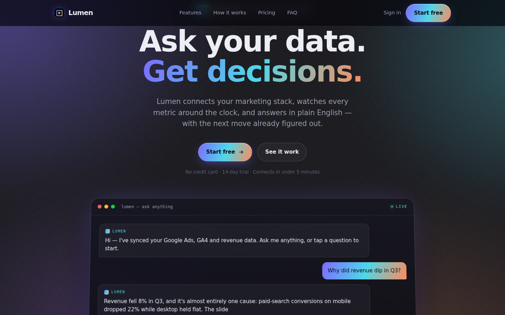

# Lumen — AI SaaS Landing Page

A premium, single-file landing page for **Lumen**, a concept "AI data analyst" product. Built to show end-to-end front-end craft: a custom design system, an animated aurora background, scroll choreography, and a fully interactive **"Ask Lumen" console** that types out AI-style answers with inline charts and recommended actions.

> Lumen is a **concept / design demo**, not a real product. Designed & built by [Debashish Kumar Bora](https://debashishkumarbora.github.io).

**🔗 Live demo:** _add your GitHub Pages URL here_ → `https://debashishkumarbora.github.io/lumen-ai/`

## Highlights
- **Interactive AI console** — click a question (or type one) and Lumen types out an answer, draws an inline sparkline, and suggests the next move.
- **Animated aurora atmosphere** — drifting gradient mesh, film grain, and a masked grid.
- **Glassmorphism bento grid** of features with animated micro-visuals.
- **Animated count-up metrics**, a monthly/annual **pricing toggle**, and an **FAQ accordion**.
- Fully **responsive**, **keyboard-accessible**, and **reduced-motion** aware.
- **100% vanilla** HTML/CSS/JS — one file, no frameworks, no build step.

## Tech
`HTML` · `CSS` (custom properties, backdrop-filter, IntersectionObserver-driven reveals) · `Vanilla JavaScript`

## Run locally
Open `index.html` in any browser. That's it.

## Deploy (free, GitHub Pages)
1. Create a public repo (e.g. `lumen-ai`) and upload `index.html`, `README.md`, `preview.png`.
2. **Settings → Pages → Source:** `main` / `root` → **Save**.
3. Live in ~1 minute at the URL above.
